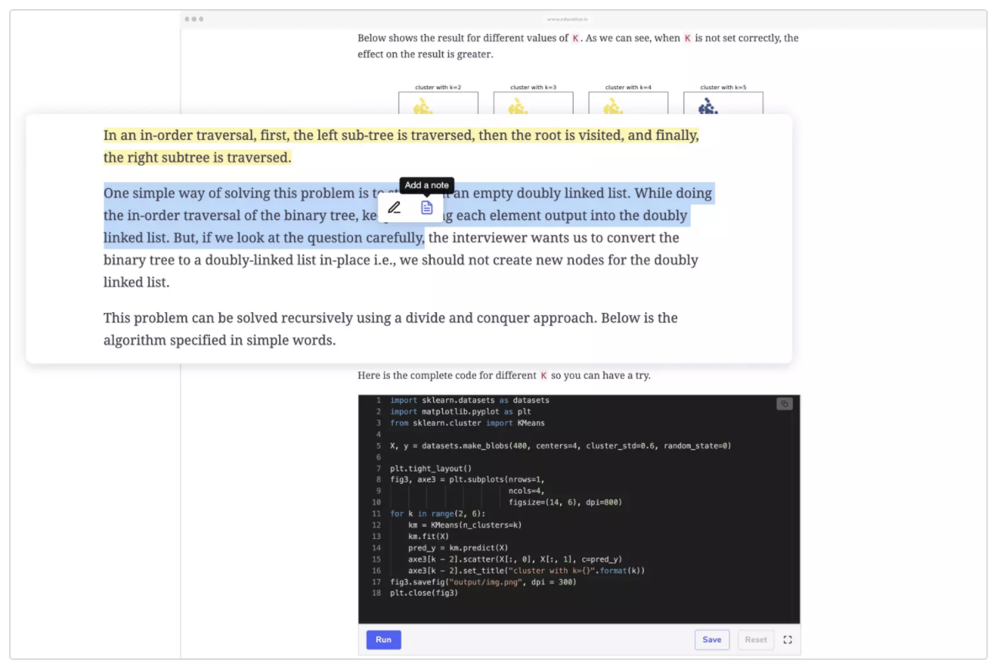
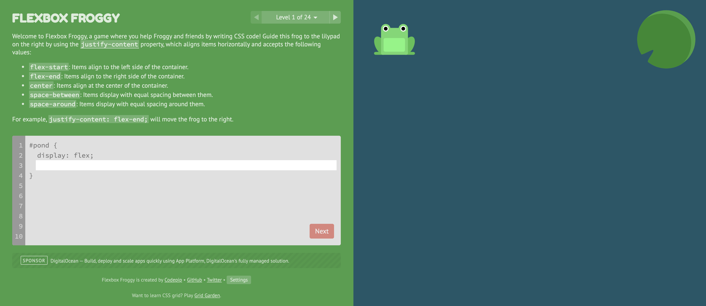
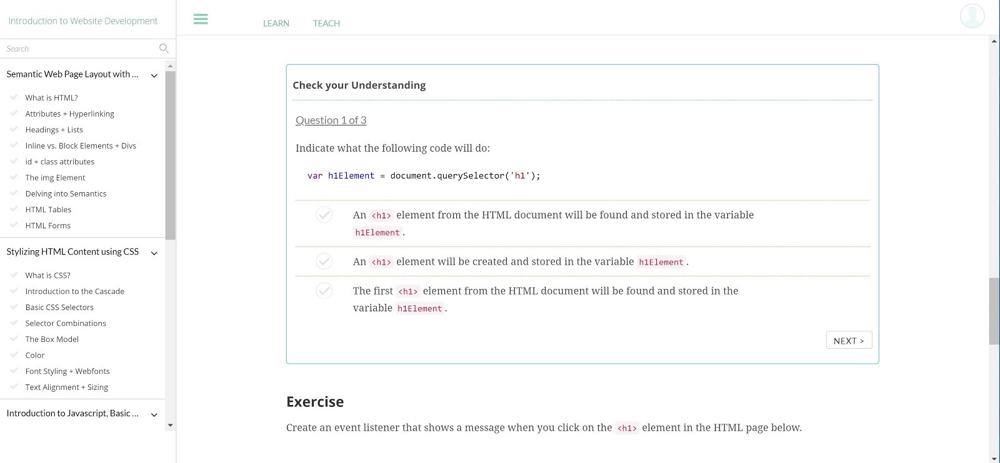
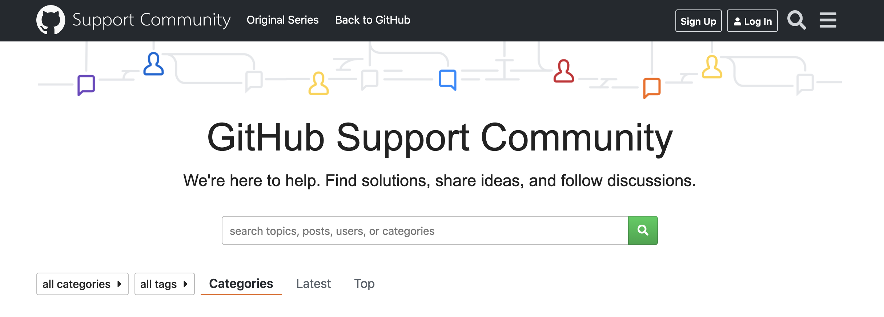
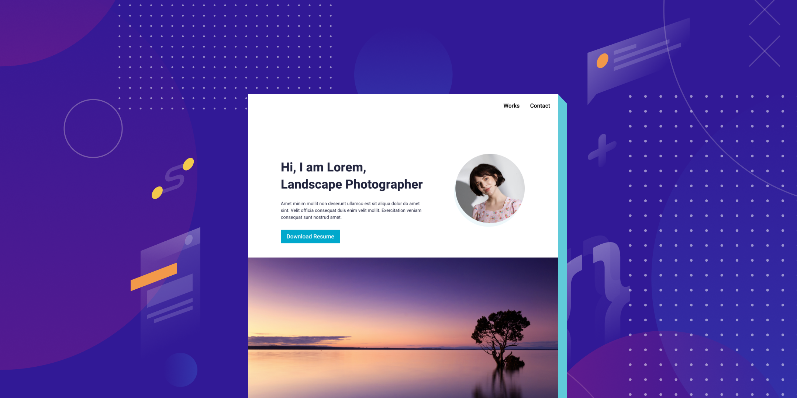

<h2>Learn Basic Coding: Creating a simple static website or online portfolio using HTML, CSS, Javascript, and GitHub Pages.</h2>

<strong>A personal website allows you to showcase to the world who you are and share your passion.</strong> It is a common assumption that setting up a website is expensive and technically challenging. Although many Content Management Systems (CMS) are available to make and host websites, most are not free, take time to set up and would sometimes still require basic coding knowledge to customise. <strong>This short course will teach learners how to create a website with basic HTML, CSS, Javascript and publish it in GitHub Pages for free.</strong>

<h3>This course is perfect for people who wants to:</h3>
<ul class="three-column-flex" data-aos="fade-up">
    <li>

        create a portfolio for a student internship or work
    </li>
    <li>

         create a simple profile page for their business
    </li>
    <li>

         learn basics of web development
    </li>
</ul>

<h3>The course will go through the following topics:</h3>
<ol>
    <li> A quick guide to creating a GitHub account and repository</li>
    <li> Sitemap creation and semantic web page layout with HTML</li>
    <li> Stylizing HTML Content using CSS (with focus on using CSS Flexbox)</li>
    <li> Adding simple website transitions or animation by using the AOS Javascript plugin.</li>
    <li> Publishing website to GitHub Pages</li>
</ol>

The course will be presented through online delivery, which means learning is asynchronous, and students can undertake the learning at their own pace and preferred space (Midkiff, Et al., 2000). A recent study conducted by the Australian Catholic University and the University of Queensland says that the control students have when viewing pre-recorded content allows them to be more autonomous, self-directed, and more motivated (Burt, 2021).

The course will be hosted in [Educative.io](https://www.educative.io/), a highly interactive platform that is perfect to learn how to program. The platform feature in-browser coding environments with no set-up required (About Educative, 2021); this will allow students to code immediately and follow-through while viewing the lecture. Hands-on learning in engineering classes brings a critical dimension, a tangible one, to student learning (Ma, Et al., 2017).

    <iframe src="https://player.vimeo.com/video/494436751?title=0&byline=0&portrait=0" width="640" height="358" frameborder="0" allow="autoplay; fullscreen; picture-in-picture" allowfullscreen></iframe>
    
<a href="https://vimeo.com/494436751">Video 1: Educative - How you will learn</a> from <a href="https://vimeo.com/educativeinc">Educative, Inc</a> on <a href="https://vimeo.com">Vimeo</a>.

Educative.io also has an option for text-based course delivery wherein students can highlight text and save notes. This feature will be beneficial for learners with hearing impairment or disability. Reading through text-based materials can also enhance the pace of learning since the average video tutorial is spoken at 150 words per minute, while you can read at 250 (Barnard, 2018).

Figure 1: Educative.io, text-based material highlighting and note feature.

Each topic will have an overview of points to be covered, along with activities and games to learn, build on, and reinforce concepts. For example, students can explore more about flexbox concepts by introducing them to [Flexbox Froggy](https://flexboxfroggy.com/), a website that hosts a game wherein they can help Froggy and friends using CSS code.

Figure 2: Flexbox Froggy game screenshot. Visit game [here](https://flexboxfroggy.com/).

Apart from coding exercises, the course will also have built-in assessments and quizzes to test students' skills and understanding of the material.

Figure 3: Sample of Educative.io quiz interface.

As students are taught to set up their GitHub accounts during the course, they will also gain access to GitHub Support Community Forums.  This platform can be used as an avenue to interact with fellow students. They can ask each other questions, help solve problems, share their progress, and showcase their website. Forums can encourage active learning as students can share their thoughts and experience and help increase understanding of the topic; it offers a sense of community when it comes to online classes (Tiwary, 2021).

Figure 4: GitHub Support Community Forums, access [here](https://github.community/).

By the end of the course, students will finally have a published website in GitHub Pages and new skills to impress their employers and friends. In addition, a completion certificate will also be provided at the end of the course.

 
<h2 class="ending-note">Thank you for viewing!</h2>
 

<h4>References:</h4>
<ul>
<li>Midkiff, S.F. and DaSilva, L.A., 2000, August. Leveraging the web for synchronous versus asynchronous distance learning. In International Conference on Engineering Education (Vol. 2000, pp. 14-18).</li>

<li>Burt, C., 2021. Study: Pre-recorded videos can boost student learning. (online) University Business Magazine. Available at https://universitybusiness.com/study-pre-recorded-videos-can-boost-student-learning, Accessed 15 May 2021.</li>

<li>Ma, J., Tucker, C.S., Okudan Kremer, G.E. and Jackson, K.L., 2017. Exposure to digital and hands-on delivery modes in engineering design education and their impact on task completion efficiency. Journal of Integrated Design and Process Science, 21(2), pp.61-78.</li>

<li>BARNARD, D., 2018. Average Speaking Rate and Words per Minute. (online) Virtualspeech.com. Available at https://virtualspeech.com/blog/average-speaking-rate-words-per-minute, Accessed 15 May 2021.</li>

<li>Tiwary, A., 2021. Why Online Forums Are Beneficial For Training - eLearning Industry. (online) eLearning Industry. Available at https://elearningindustry.com/why-online-training-discussion-forums-beneficial, Accessed 15 May 2021.</li>

<li>Educative: Interactive Courses for Software Developers. 2021. About Educative. (online) Available at https://www.educative.io/m/about, Accessed 15 May 2021.</li>
<ul>

