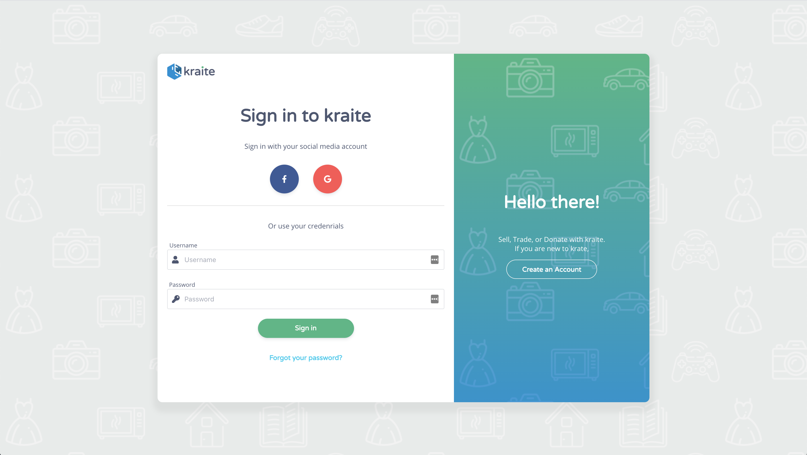

Kraite.com is an online platform where users can donate, sell, or trade. At Kraite, you can not only sell your items but can also choose to help and donate as well. We wanted to connect people who wanted to give their preloved items to people who need them the most. You can also trade your collections to people with the same interests or hobby.

<h2>Deliverables</h2>

Kraite.com is a web and iOS application currently being made from the ground-up. I am currently working on the logo design, website concept, illustrations, and frontend development using Vue.js for this website. Below is the Style guide being made for the system. This will serve as the main building blocks of the website.

Login screen made from the style-guide elemnts.

<h2>Kraite Illistrations</h2>

Here are some of the illustrations I made for Kraite.

 
<h2 class="ending-note">Thank you for viewing!</h2>
 
<a href="https://www.kraite.com" target="_blank" class="work-page__button-link">Visit Project Page</a>

