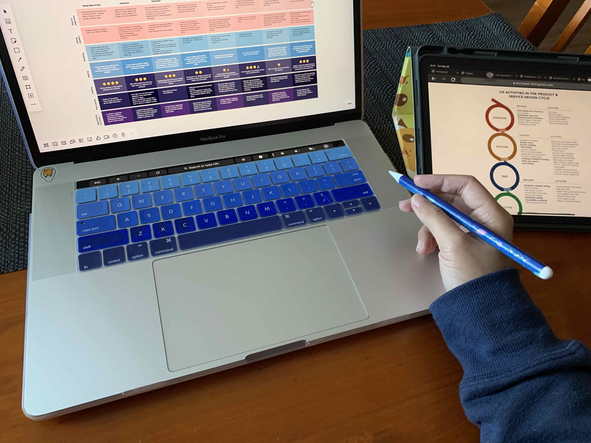
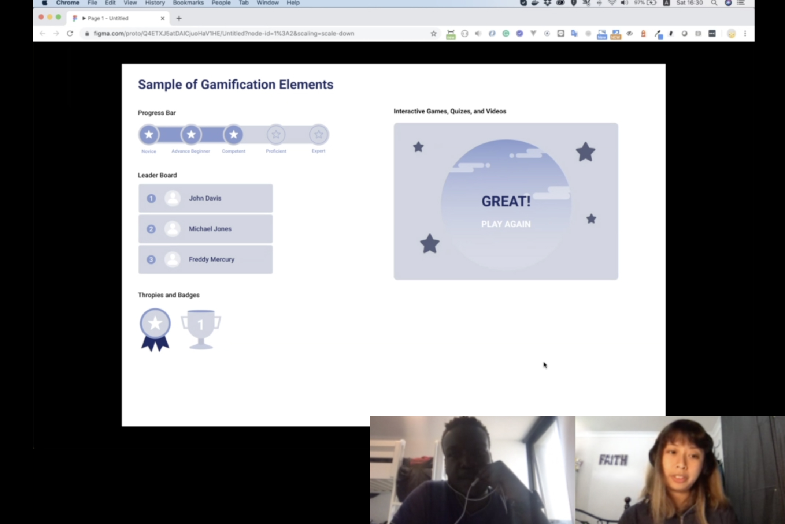
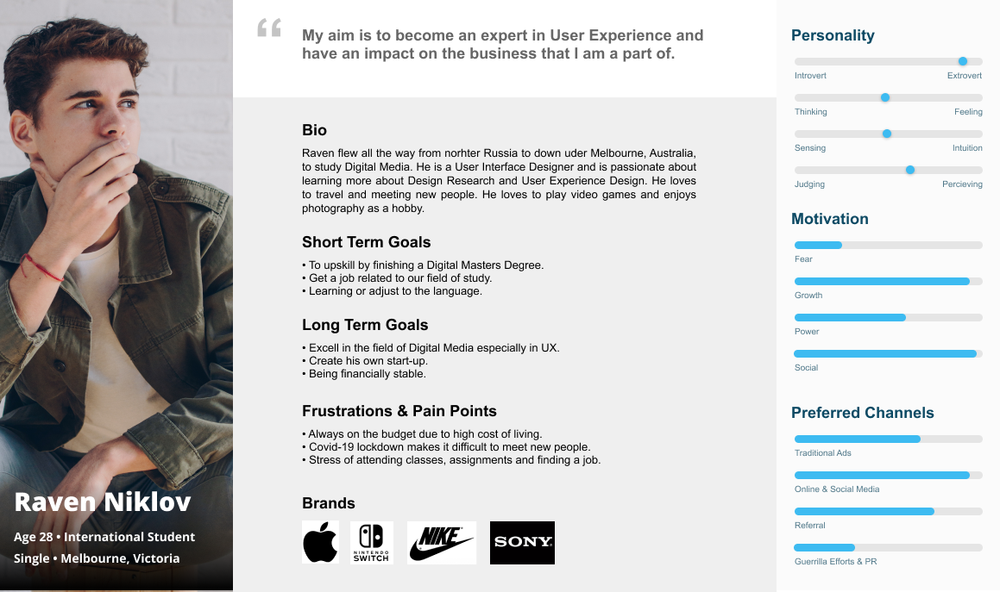
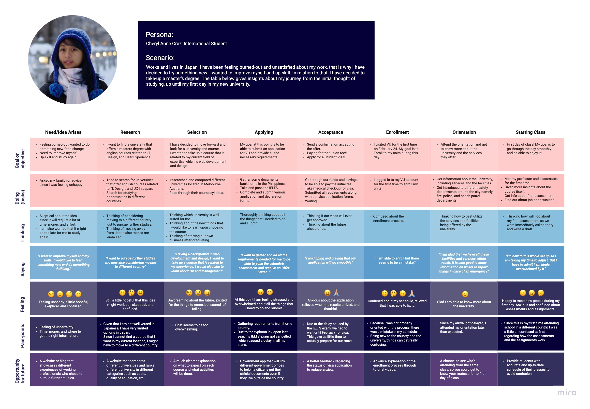

Today, the shift from traditional media to digital is inevitable in different industries such as health, government, real estate, and education. As these industries undergo digital transformations, the need to create new digital solutions and products that are intuitive, usable, and human-centered is increasing. Along with this change and demand brings about the relevance of Design Reserch.

Design research is foundational to creating products, services, and systems that respond to human needs. It is a crucial step in creating optimal user experience. It allows you to understand complex human behavior and turn that into actionable insights to improve your design.

By conducting design research you will be able to learn more about your users or customers, and it will help you answer these questions:

  * Who are your users or customers?
  * What are their pain-points or problems they are facing?
  * How will they use your product or service?

How can this be achieved? There's an endless number of ways to collect data about your customers. One of the most common approaches is to conduct **focus groups**, **usability sessions**, **surveys**, and **interviews** which involves you or your team going directly to the source (your customers) to ask questions and gather data.

An Interview conducted online through skype to gain insights about a new online learning sytem with integrated gamification elements.

Through conducting these, you will be able to design based on facts and not assumptions. By analyzing the gathered data, you can point out common situations and traits of your user. This will help you Identify a **User Persona**. Personas are fictional characters designers use to reflect user types, pinpointing who they are and what they do with products in relevant contexts. Designers create personas from user data, to understand user characteristics, needs, goals, etc. and gain valuable insights into user journeys.

[Xtensio](https://xtensio.com/), a web application can be used to make User Personas.  
You can also create one using [Figma](https://figma.com/). View file [Here](https://www.figma.com/file/w8qHkj3kcYuhtEgJvKX0eb/User-Persona?node-id=0%3A1).

A **User Journey Map** is a visual representation of the customer experience. It identifies vital interactions and describes in detail the customer's goals, motivations, pain-points, and feelings at each step.

User Journey Maps can be made using a web application called [Miro](https://miro.com/).  
View Journey Map [Here](https://miro.com/app/board/o9J_krjFFoo=/).

Design research takes time, resources, and preparation, but the results are worth it. Here are four of the top benefits of design research:

* Allows you to design based on facts and not assumptions.
* Helps with focus and prioritization.
* Fosters more empathy for your customers.
* Results in happier customers.

Design Research teaches us to keep in mind that "We are not our users" as it guides teams to uncover insights with the rigorous study of the people they serve and their context. There is always something new to learn.

---

  
References:

  * Emily Esposito, A quick guide to design research, May 8, 2018, https://www.invisionapp.com/inside-design/design-research/
  * Optimizely, User Journey Map, https://www.optimizely.com/anz/optimization-glossary/user-journey-map/
  * Interaction Design Foundation, Pesonas, https://www.interaction-design.org/literature/topics/personas

