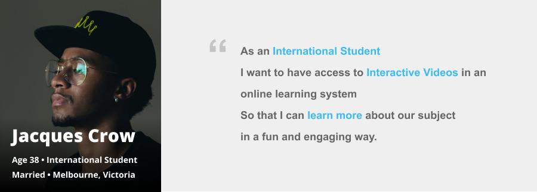

Today, the shift from traditional media to digital is inevitable in different industries such as health, government, real estate, and education. As these industries undergo digital transformations, the need to create new digital solutions and products that are intuitive, usable, and human-centered is increasing. Along with this change and demand brings about the relevance of Design Reserch.

Design research is foundational to creating products, services, and systems that respond to human needs. It is a crucial step in creating optimal user experience. It allows you to understand complex human behavior and turn that into actionable insights to improve your design.

By conducting design research you will be able to learn more about your users or customers, and it will help you answer these questions:

  * Who are your users or customers?
  * What are their pain-points or problems they are facing?
  * How will they use your product or service?

One of the most common approaches is to conduct **focus groups**, **usability sessions**, **surveys**, and **interviews** which involves you or your team going directly to the source (your customers) to ask questions and gather data.

An Interview conducted online through skype to gain insights about a new online learning sytem with integrated gamification elements.

Through conducting these, you will be able to design based on facts and not assumptions. By analyzing the gathered data, you can point out common situations and traits of your user. This will help you Identify a **User Persona**. The user persona below is a fictional characters designed to reflect the most common traits of an International Student based on the conducted user interview. This will give an understanding of the user's characteristics, needs, goals, etc. and gain valuable insights into user journeys.

[Xtensio](https://xtensio.com/), a web application can be used to make User Personas.  
You can also create one using [Figma](https://figma.com/). View file [Here](https://www.figma.com/file/w8qHkj3kcYuhtEgJvKX0eb/User-Persona?node-id=0%3A1).

A **User Journey Map** is a visual representation of the customer experience. It identifies vital interactions and describes in detail the customer's goals, motivations, pain-points, and feelings at each step. The Journey map below describes my journey of being an International student. It gives insights about my goals,  the things I did, what I thought, and feel during the process.

User Journey Maps can be made using a web application called [Miro](https://miro.com/).  
View Journey Map [Here](https://miro.com/app/board/o9J_krjFFoo=/).

A **User Story** are a few sentences in simple language that outline the desired outcome. It’s an end goal, not a feature, expressed from the software user’s perspective.

View User Story [Here](https://www.figma.com/file/w8qHkj3kcYuhtEgJvKX0eb/User-Persona?node-id=0%3A1).

Design research takes time, resources, and preparation, but the results are worth it. It teaches us to keep in mind that "We are not our users" as it guides teams to uncover insights with the rigorous study of the people they serve and their context. Here are four of the top benefits of design research:

* Allows you to design based on facts and not assumptions.
* Helps with focus and prioritization.
* Fosters more empathy for your customers.
* Results in happier customers.

There is always something new to learn about your users. <strong>Do you have a project in mind? Let's dive-in through this process together!
Contact me if you need any help embarking through this journey!</strong>

 
<h2 class="ending-note">Thank you for viewing!</h2>
