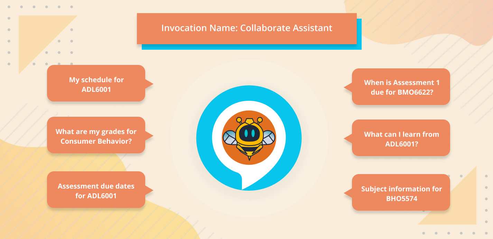

<h2>Background: A need for Better User Experience and Accessibility</h2>

VU Collaborate is Victoria University's Learning Management System, and is built using Brightspace Core LMS. Students mainly use VU Collaborate to perform the following tasks:
<ul>
    <li>View course units and materials</li>
    <li>Read about assessment information</li>
    <li>Submit assignments</li>
    <li>Receive grades and feedback</li>
    <li>Check for news and notifications</li>
</ul>

In a [student interview session](https://drive.google.com/file/d/1U2J0vxLSR_D67OkrkkTvPZmCK9NDUmWK/view?usp=sharing) conducted last 2020 for the class Visual Digital Media and Global World (ADM5001), study results show that most students share the same views about the current drawbacks of the system. Students have stated the following disadvantages when using the platform:

<ul>
    <li>Hard to navigate, especially for new users</li>
    <li>The interface is not very intuitive</li>
    <li>Difficult to find specific information</li>
    <li>There are no proper onboarding of features; thus, many features are not well presented and utilized</li>
</ul>

<h2>CUIs: Enhancing the VU Collaborate Experience Using a Voice-enabled Chatbot</h2>

Conversational user interfaces or CUIs, such as chatbots and voice assistants, are increasingly common in areas of day-to-day life and can be expected to become ever more prevalent in the future (Deibel, D., Evanhoe, R., 2021). These interfaces are being designed for ever more complex interactions. They appear to have the potential to benefit people with disabilities to interact through the web and with technologies embedded in the environment (Batish, R., 2018).

Some advantages of voice-enabled chatbots are as follows:

<ul>
    <li>Provides instant response and feedback</li>
    <li>Improves availability of data on different devices through cloud-based technology</li>
    <li>Conveys emotions in a conversation through the use of Speech Synthesis Markup Language (SSML) (Amazon Alexa Developer Documentation)</li>
    <li>Simplifies interaction by making use of simple voice commands (Dua, M., 2019)</li>
    <li>Eases navigation of information through the use of navigational intents</li>
    <li>Promotes inclusive dialogue </li>
</ul>

And essentially, CUIs benefit people with disabilities, particularly for users with dyslexia or any visual impairment, as dialogue can be more appropriate since graphical interfaces and layouts can be more complicated and require assistive technology (K. Lister, Et al., 2020).

<h2>Introducing CollaBeeBot</h2>

CollaBeeBot was made as a potential solution to enhance the VU collaborate experience. It is a virtual assistant bot powered by Amazon Alexa. Its features focus on the common tasks students perform when using the VU Collaborate platform. These tasks are simplified by making use of simple voice command prompts.

<h3>Students may ask about:</h3>
<ul class="four-column-flex" data-aos="fade-up">
    <li>

        subject information
    </li>
    <li>

         assessment details and due dates
    </li>
    <li>

         daily and weekly schedules
    </li>
    <li>

         assessment results or grades
    </li>
</ul>

The figure below illustrates the processing of data for voice-enabled chatbots such as Amazon Alexa.

Figure 1: Illustration of Amazon Alexa data process.

The diagram below shows sample intents students may use or ask while interacting with CollaBeeBot. An intent represents an action that fulfils a user's spoken request. The following intents also make use of slots. Slots are variables in utterances, in this particular case, the subject codes such as ADL6001, Consumer Behaviour, etc. A Slot is a specific piece of information that can be derived from an utterance and is used to fulfil the user's intent. Each slot is mapped to a Slot Type. The slot type defines the type of information that the bot should look for as the slot within an utterance (Amazon Alexa Developer Documentation)

Figure 2: Diagram of sample intents.

<h2>Sample Recording</h2>

<iframe
   frameborder="0"
   width="500"
   height="100"
   src="https://drive.google.com/file/d/16HzMGySeY3I6Re8SE6uoYhQ5apLK5wgP/preview">
</iframe>

<h2>Room for Future Improvements</h2>

Every new technology also comes with some disadvantages, and some weakness of voice-enabled chatbots includes the following:

<ul>
    <li>Made to handle first-level questions</li>
    <li>Time-consuming to create and require maintenance</li>
    <li>Voice-enabled chatbots may fail to analyze voices in noisy areas</li>
    <li>They aren't human. Despite continuous improvements aiming to make them more "life-like," chatbots can still seem mechanical (Smith, R., 2020)</li>
</ul>

Given the early stage of research and development in accessible CUI, there is room for exploration. With further work, clearer methods to ensure accessibility in this space should emerge. A larger question for debate is to what extent CUIs can be more accessible and helpful to people with disabilities than other interfaces. The area of opportunities has yet to be mapped (Batish, R., 2018).

 
<h2 class="ending-note">Thank you for viewing!</h2>
 

<h4>References:</h4>
<ul>

<li>Amazon Alexa Developer Documentation, Speech Synthesis Markup Language (SSML) Reference, https://developer.amazon.com/en-US/docs/alexa/custom-skills/speech-synthesis-markup-language-ssml-reference.html</li>

<li>Amazon Alexa Developer Documentation, Implement the Built-in Intents, https://developer.amazon.com/en-US/docs/alexa/custom-skills/implement-the-built-in-intents.html</li>

<li>Batish, R., 2018. Voicebot and Chatbot Design: Flexible Conversational Interfaces with Amazon Alexa, Google Home, and Facebook Messenger. Packt Publishing Ltd.</li>

<li>Deibel, D., Evanhoe, R., 2021. Conversations with Things: UX Design for Chat and Voice. Rosenfeld Media Llc, 20 Apr 2021</li>

<li>Dua, M., 2019. Why Voice-Enabled Chatbot Is The Future Of Internet?, Chatbots Journal, https://chatbotsjournal.com/why-voice-enabled-chatbot-is-the-future-of-internet-29326af705d3</li>

<li>Lister, Kate & Coughlan, Tim & Iniesto, Francisco & Freear, Nick & Devine, Peter. (2020). Accessible conversational user interfaces: considerations for design. 1-11. 10.1145/3371300.3383343. </li>

<li>Smith, R., 2020. Pros And Cons Of AI Chatbots: All You Must Know, Chatbots Life, https://chatbotslife.com/pros-and-cons-of-ai-chatbots-all-you-must-know-9de01ff3a373</li>

<ul>

