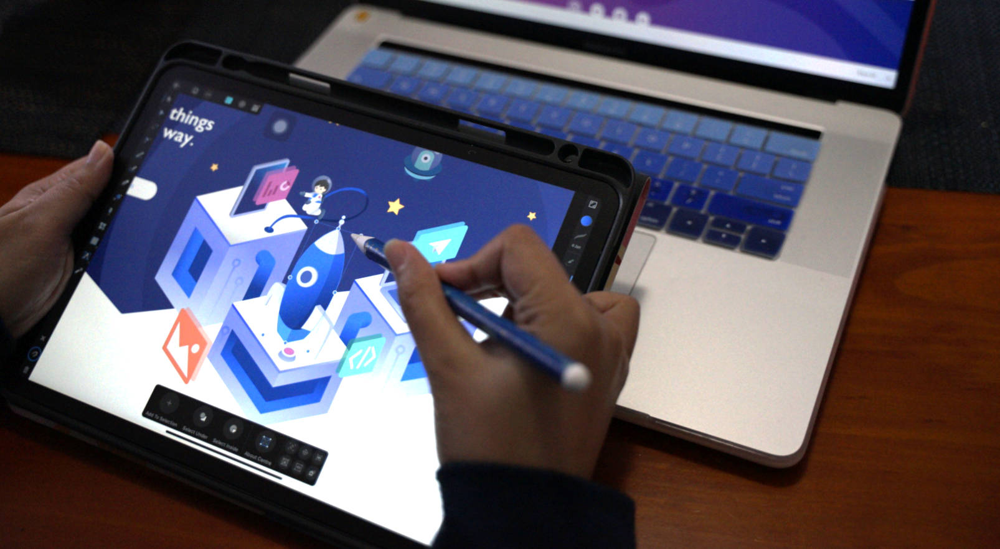
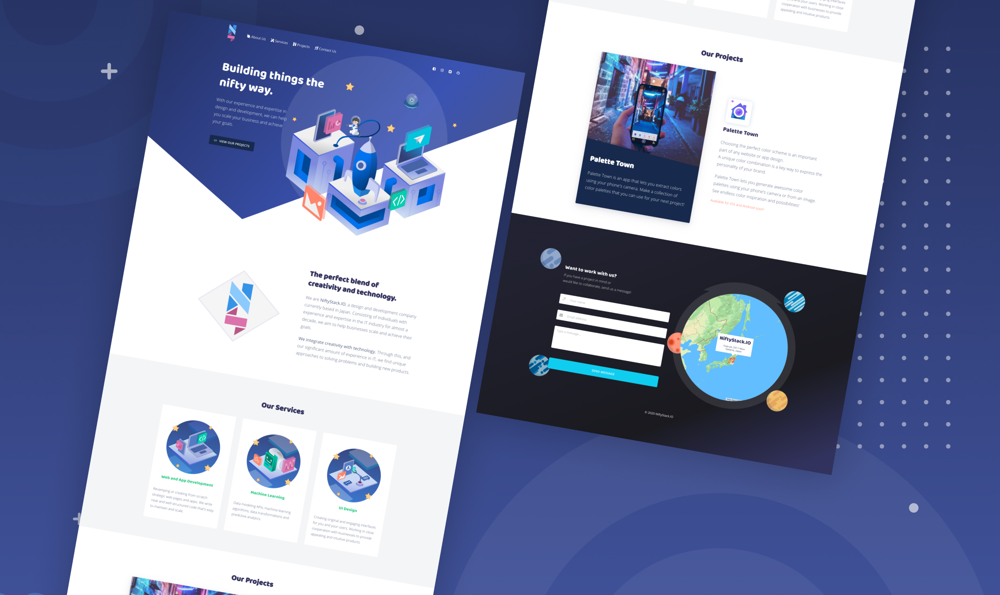

The perfect blend of creativity and technology. We are NiftyStack.IO, a design and development company founded in Japan and relocated to Melbourne Australia. Consisting of individuals with experience and expertise in the IT industry for almost a decade, we aim to help businesses scale and achieve their goals.

We integrate creativity with technology. Through this, and our significant amount of experience in IT, we find unique approaches to solving problems and building new products.

<h2>Our Logo</h2>

As our name suggests, our logo is comprised of shapes "niftly" stacked together to create the NS initials. With the colours Blue as we are trustworthy and responsible in handling our clients and projects, and Pink as we love and very passionate about what we do.

<h2>Deliverables</h2>

The NiftyStack website is a fully responsive one built on top of Vue Material Template. I worked on doing the logo design, website concept, illustrations, and frontend development for this website. As we love trying new things, I also experimented on making 3D hover effects in our services section.

I created vector illustrations and mock-ups using Affinity Designer.

<h2>Complete homepage</h2>

After many discussions, iterating the design many times and completing the illustrations, we finally completed the design for the homepage.

 
<h2 class="ending-note">Thank you for viewing!</h2>
 
<a href="https://www.niftystack.io" target="_blank" class="work-page__button-link">Visit Project Page</a>

