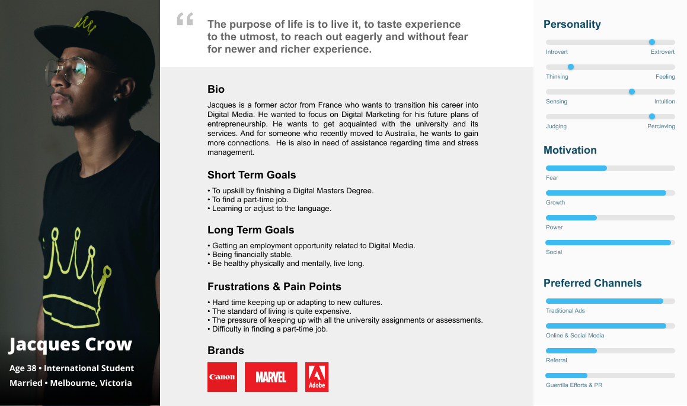
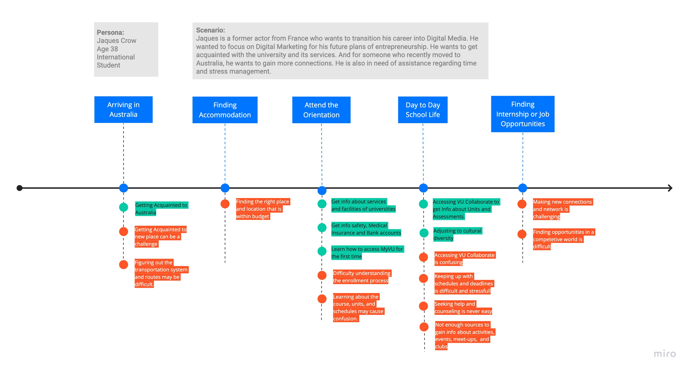
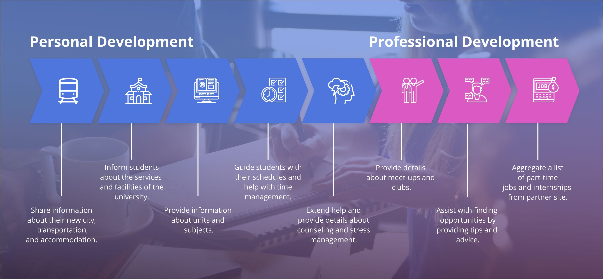
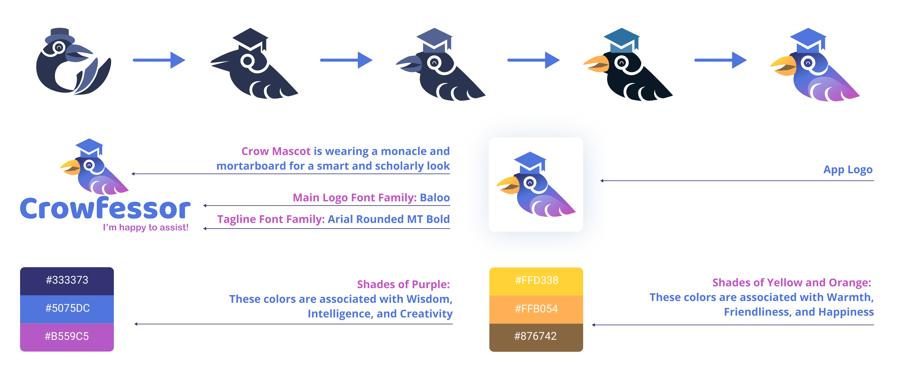

Crowfessor, is a virtual professor application that will help students especially international students to be more informed about university life and help with personal and professional development.

<h2>Background: A Need for Guidance and Assistance</h2>

As the number of international students increases over time, there is also an increasing demand for an adequate amount of guidance and proper assistance. Being an international student has its fair share of challenges, including moving to a new country, coping up to a new environment, and dealing with stress. All of these can take a toll on a student's well being.

To investigate this further, our team interviewed several international students. Through this, we were able to shed some light on their situation and determine their pain-points.

<h2>User Persona and Journey Map</h2>

After conducting user interviews, we were able to determine our user persona. Creating the user persona helped us understand our target user's goals, expectations, and frustrations.

 View User Persona [Here](https://www.figma.com/file/w8qHkj3kcYuhtEgJvKX0eb/User-Persona?node-id=0%3A1).

We also made a User Journey Map as an overview of what international students have to go through when they are transitioning to a new country and university. Through this, we're able to identify their pain-points.

View Journey Map [Here](https://miro.com/app/board/o9J_krjCrlo=/).

<h2>Crowfessor's Key Features</h2>

Crowfessor's key fetaures are categorized into Personal and Professional Development.

For Personal Development, we aim to help students be more informed. While Professional Development, focuses mainly on developing their Interpersonal Skills.

<h2>Logo Design</h2>

<h2>UI Mock-ups</h2>

View More of Crowfessor [Here](https://www.figma.com/file/NWgDCVRIxZHYfsekILSnxE/CROWFESSOR-ASSETS?node-id=57%3A123).

 
<h2 class="ending-note">Thank you for viewing!</h2>